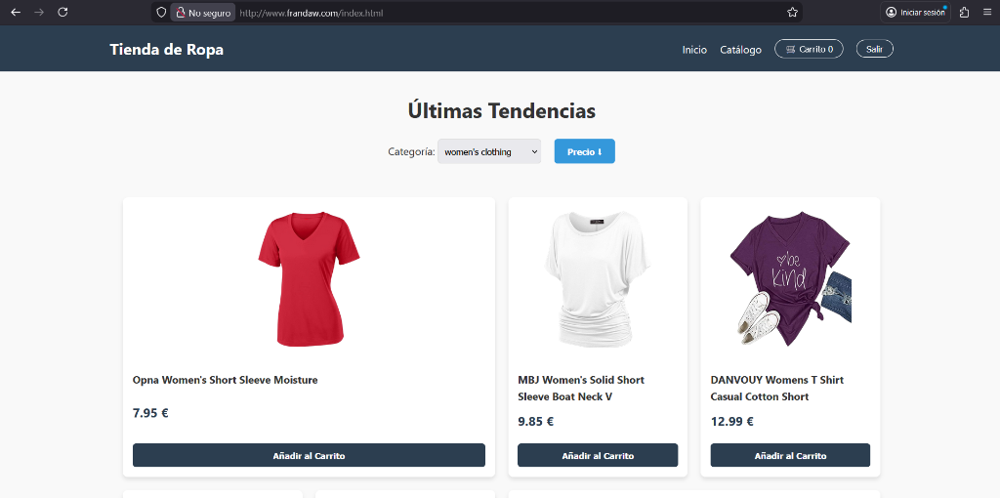
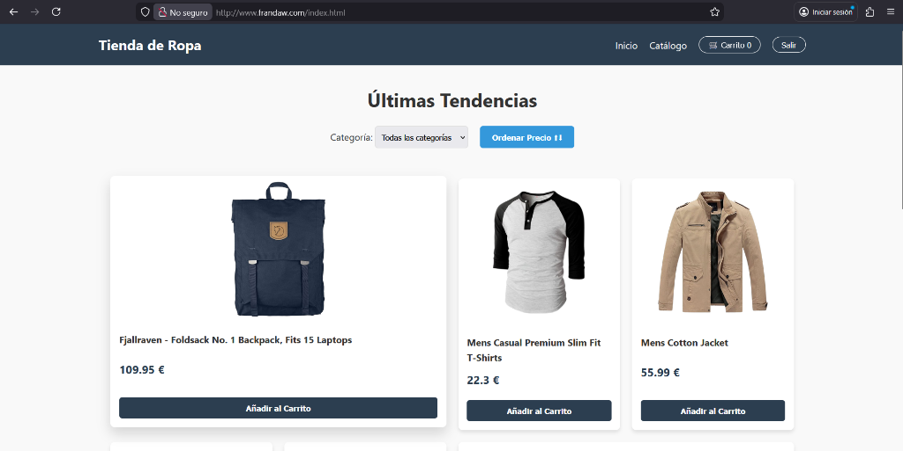
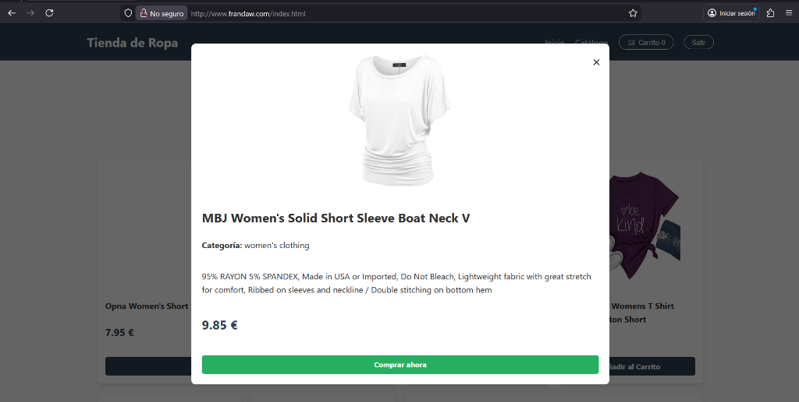
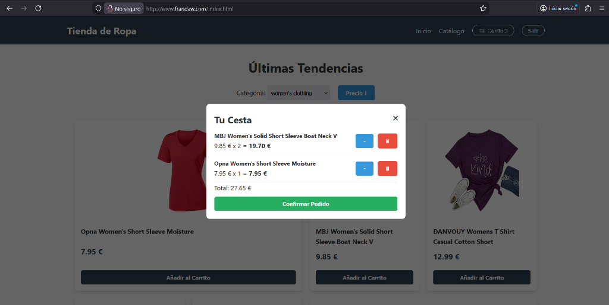
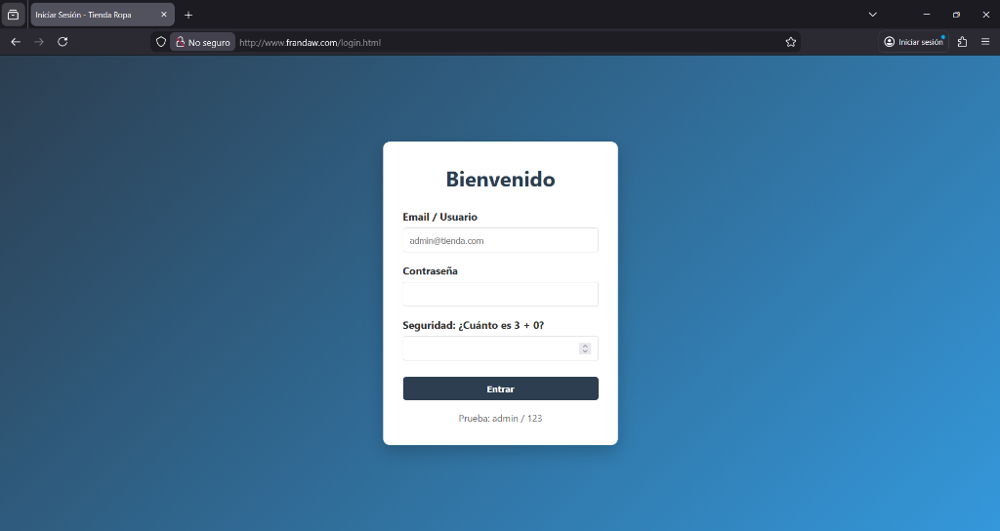

# 🎄 Proyecto Navidad - Tienda Online JS


¡Hola! Soy **Fran**, alumno de 2º de DAW. Este es mi proyecto para el primer trimestre: una **Single Page Application (SPA)** de comercio electrónico totalmente funcional, simulando una tienda de ropa online.

🔗 **Ver Proyecto Online:** [http://www.frandaw.com] 
*(Nota: Si el enlace no funciona, revisa la sección de despliegue abajo)*

---

## 🚀 Características Principales

El proyecto ha sido desarrollado siguiendo una arquitectura profesional y moderna:

*   **SPA (Single Page Application):** Navegación fluida sin recargas de página.
*   **Gestión de Estado:** Carrito de compras persistente y gestión de sesiones de usuario.
*   **Arquitectura CSS BEM:** Estilos modulares y mantenibles.
*   **Conexión a APIs:**
    *   **FakeStoreAPI:** Para obtener el catálogo de productos real.
    *   **JSON Server:** Backend simulado para gestión de usuarios (Login/Registro).
*   **Despliegue CI/CD:** Pipeline automatizado con GitHub Actions para desplegar en AWS EC2 usando Docker.

## 🛠️ Stack Tecnológico

He utilizado las siguientes tecnologías aprendidas durante el curso:

*   **Frontend:** HTML5, CSS3 (Grid & Flexbox), JavaScript (ES6 Modules).
*   **Backend (Simulado):** Node.js + JSON Server.
*   **Infraestructura:** Docker, Nginx (como servidor web).
*   **Control de Versiones:** Git & GitHub (Git Flow).

---

## � Instalación y Ejecución Local

Si quieres probar el proyecto en tu máquina, sigue estos pasos:

### Prerrequisitos
*   Tener **Node.js** instalado.
*   (Opcional) Tener **Docker** si quieres probar la versión contenerizada.

### Pasos

1.  **Clonar el repositorio:**
    ```bash
    git clone https://github.com/FranJJL05/proyecto_navidad.git
    cd proyecto_navidad
    ```

2.  **Iniciar el Backend Simulado (Usuarios):**
    Necesitas `json-server` para el login.
    ```bash
    npm install -g json-server
    npx json-server --watch db.json --port 3000
    ```

3.  **Ejecutar la Web:**
    Simplemente abre el archivo `index.html` en tu navegador o usa una extensión como *Live Server* en VSCode.

---

## 🐳 Ejecución con Docker

También he dockerizado la aplicación para facilitar su despliegue:

1.  **Construir la imagen:**
    ```bash
    docker build -t tienda-navidad .
    ```

2.  **Correr el contenedor:**
    ```bash
    docker run -d -p 8080:80 --name tienda-app tienda-navidad
    ```
    Ahora accede a `http://localhost:8080`.

---

## 📸 Comprobación de Funcionamiento

Aquí tienes una demostración visual de las funcionalidades clave del proyecto finalizado:

| **Vista Principal** | **Catálogo de Productos** |
|:---:|:---:|
|  |  |
| *Página de inicio con productos destacados* | *Filtrado y ordenación de productos* |

| **Detalle de Producto** | **Carrito de Compras** |
|:---:|:---:|
|  |  |
| *Modal con información extendida* | *Gestión de cesta y cálculo de total* |

| **Login de Usuario** |
|:---:|
|  |
| *Acceso seguro para usuarios* |

---

## ☁️ Despliegue (CI/CD)

El proyecto cuenta con un flujo de trabajo de **GitHub Actions** (`.github/workflows/deploy.yml`) que automatiza el despliegue:

1.  Al hacer **push a la rama `main`**, se activa el workflow.
2.  Se conecta por SSH a una instancia **EC2 de AWS**.
3.  Actualiza el código, reconstruye la imagen de Docker y reinicia el contenedor automáticamente.
